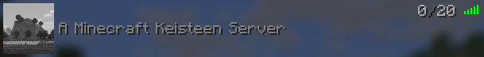

# Keisteen
*Keisteen is an experimental Minecraft Server implementation written in Rust.*

**Why?**
a) Why not?
b) For fun!

There are lots of Minecraft Server implementations written in Rust to be found, and I do not intend to challenge them. This project is mostly a side-project that started out of curiosity, so do not expect it to work, be fast or, God forbid, be stable.

## Checklist
- [ ] Handshaking
	- [x] Handle intended connection state
	- [ ] Kick player if protocol versions do not match
	- [ ] Handle legacy server list ping packet
- [ ] Status
	- [ ] Status response
		- [x] Version
		- [ ] Players
		- [ ] Description
			- [x] Send hardcoded description
			- [ ] Send customizable description
		- [ ] Favicon
		- [ ] Enforce secure chat
	- [x] Pong response
- [ ] Login
	- [ ] Handle disconnected packet
	- [ ] Encryption
		- [x] Encrypt packets
		- [ ] Authenticate
	- [ ] Compression
	- [ ] Login plugin request packet
	- [ ] Cookie packets
	- [ ] Send player properties
- [ ] Transfer
- [ ] Configuration
	- [ ] Use client information to store their settings
	- [ ] Cookie packets
	- [ ] Plugin messages
		- [ ] Store client brand
		- [x] Send server brand
		- [ ] Expose received plugin messages to API
	- [ ] Keep-alive packets
	- [ ] Ping-pong packets
	- [ ] Resource packs
	- [ ] Synchronize known packs
	- [ ] Handle custom click action
	- [ ] Reset chat packet
	- [ ] Registry packets
		- [x] Basic registry support
		- [ ] Send all registries to client
	- [ ] Send feature flags
	- [ ] Update tags
	- [ ] Dialogs
	- [ ] Server links
- [ ] Play
	- [ ] Allow player to log in
- [ ] Server config
  - [ ] Properties
      - [ ] accepts-transfers
      - [ ] allow-flight
      - [ ] broadcast-console-to-ops
      - [ ] broadcast-rcon-to-ops
      - [ ] bug-report-link
      - [ ] difficulty
      - [ ] enable-code-of-conduct
      - [ ] enable-jmx-monitoring
      - [ ] enable-query
      - [ ] enable-rcon
      - [ ] enable-status
      - [ ] enforce-secure-profile
      - [ ] enforce-whitelist
      - [ ] entity-broadcast-range-percentage
      - [ ] force-gamemode
      - [ ] function-permission-level
      - [ ] gamemode
      - [ ] generate-structures
      - [ ] generator-settings
      - [ ] hardcore
      - [ ] hide-online-players
      - [ ] initial-disabled-packs
      - [ ] initial-enabled-packs
      - [ ] level-name
      - [ ] level-seed
      - [ ] level-type
      - [ ] log-ips
      - [ ] management-server-enabled
      - [ ] management-server-host
      - [ ] management-server-port
      - [ ] management-server-secret
      - [ ] management-server-tls-enabled
      - [ ] management-server-tls-keystore
      - [ ] management-server-tls-keystore-password
      - [ ] max-chained-neighbor-updates
      - [x] max-players
      - [ ] max-tick-time
      - [ ] max-world-size
      - [ ] motd
      - [ ] network-compression-threshold
      - [ ] online-mode
      - [ ] op-permission-level
      - [ ] pause-when-empty-seconds
      - [ ] player-idle-timeout
      - [ ] prevent-proxy-connections
      - [ ] query.port
      - [ ] rate-limit
      - [ ] rcon.password
      - [ ] rcon.port
      - [ ] region-file-compression
      - [ ] require-resource-pack
      - [ ] resource-pack
      - [ ] resource-pack-id
      - [ ] resource-pack-prompt
      - [ ] resource-pack-sha1
      - [x] server-ip
      - [x] server-port
      - [ ] simulation-distance
      - [ ] spawn-protection
      - [ ] status-heartbeat-interval
      - [ ] sync-chunk-writes
      - [ ] text-filtering-config
      - [ ] text-filtering-version
      - [ ] use-native-transport
      - [ ] view-distance
      - [ ] white-list
